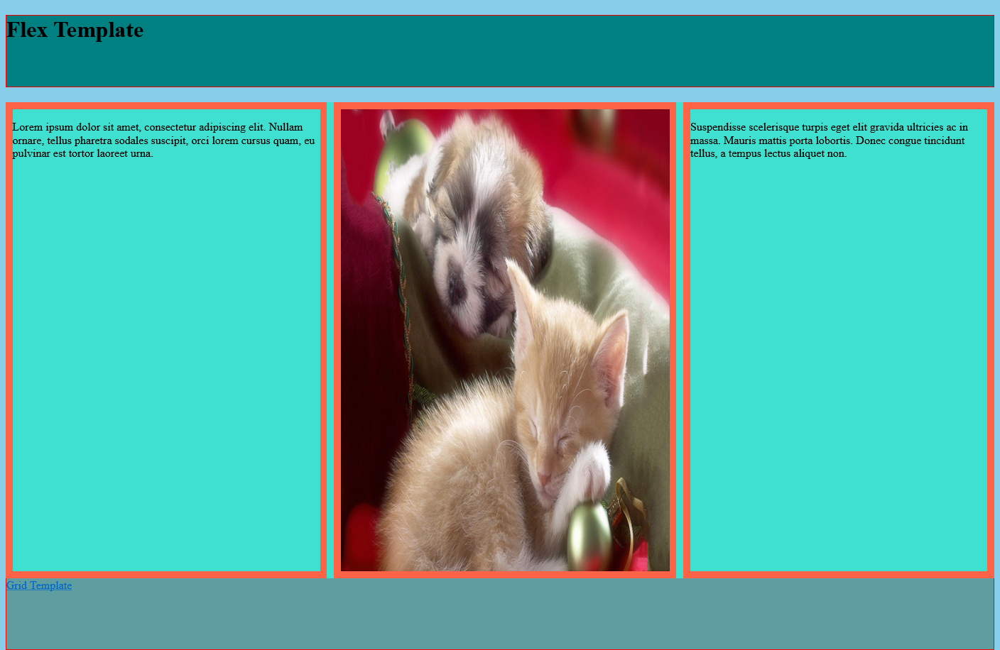

## Table of contents

- [Overview](#overview)
  - [flex and grid](#flex-and-grid)
  - [Built with](#built-with)
  - [Screenshot](#screenshot)
  - [Author](#author)

## Overview

### Flex and Grid

Welcome to my Flex and Grid project!

This my first Github project ever and first time i used flex and grid. This project is very simple but at the time it was challenging for me.

### Built with

- html
- css
- flex
- grid

### Screenshot

### Author

[Github](https://github.com/Rasweb)

[Website](https://rasweb.one/)
